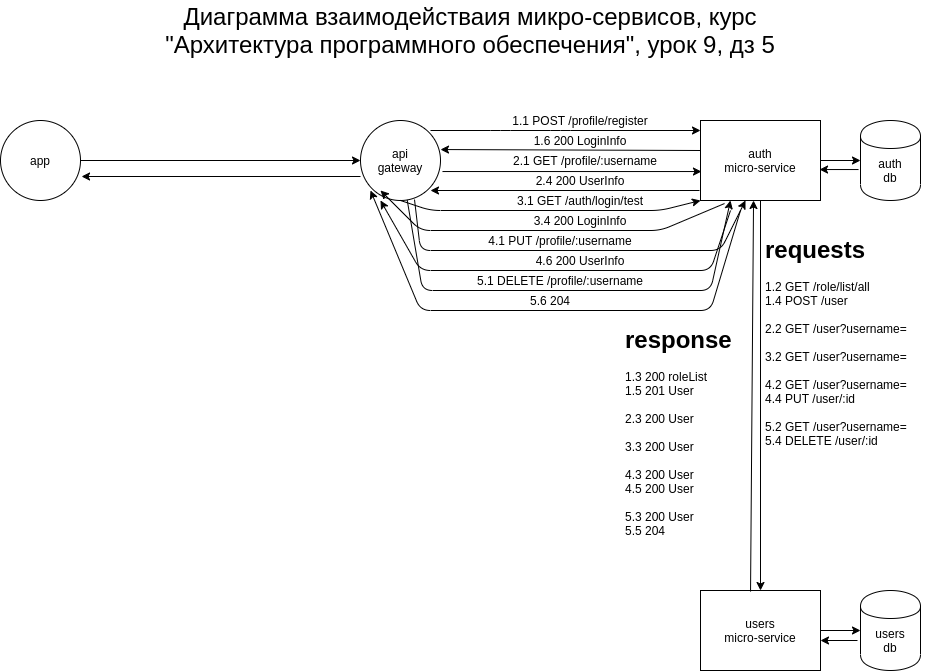

##Домашнее задание #5
# диаграмма

# docker
`./build.sh` - собрать образы (linux)
\
`./remove.sh` - удалить образы (linux)

# kubectl запустить auth-proxy
`sudo kubectl apply -f auth-ingress.yaml`
# helm
## скрипты
`./start.sh` - запуск (linux)
\
`./stop.sh` - останов (linux)
## командная строка
### запуск
`sudo kubectl apply -f auth-ingress.yaml`
\
`sudo helm install users ./users-chart`
\
`sudo helm install auth ./auth-chart`
### останов
`sudo helm uninstall auth`
\
`sudo helm uninstall users`
\
`sudo kubectl delete ingress auth-proxy`
\
`sudo kubectl delete ingress auth`
\
`sudo kubectl delete ingress users`
####Внимание!!! возможен перезапуск контейнера с микро-сервисом (не пугайтесь)

# postman
коллекция подготовлена для отработки тестового кейса (см. описание тестового кейса hw_task.odt)

# newman
`newman run ./postman/elfastahe-hw5-collection.postman_collection.json --verbose --color on`