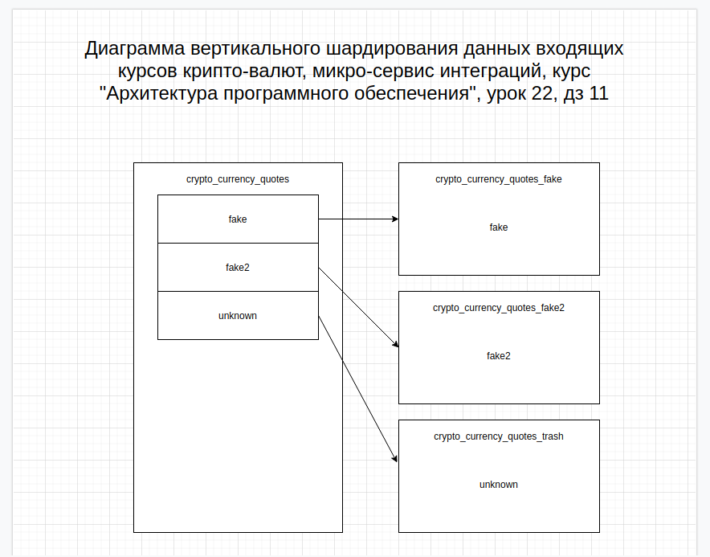

##Домашнее задание #11
# диаграмма

# docker
`./build.sh` - собрать образы (linux)
\
`./remove.sh` - удалить образы (linux)
# helm
## скрипты
`./start.sh` - запуск (linux)
\
`./stop.sh` - останов (linux)
## командная строка
### запуск
`sudo kubectl apply -f integrations-ingress.yaml`
\
`sudo helm install integrations ./integrations-chart`
### останов
`sudo helm uninstall integrations`
\
`sudo kubectl delete ingress integrations-proxy`
####Внимание!!! возможен перезапуск контейнера с микро-сервисом (не пугайтесь)

# postman
коллекция подготовлена для отработки тестового кейса (см. описание тестового кейса hw_task.odt)

# newman
`newman run ./postman/elfastahe-hw11-collection.postman_collection.json --verbose --color on`